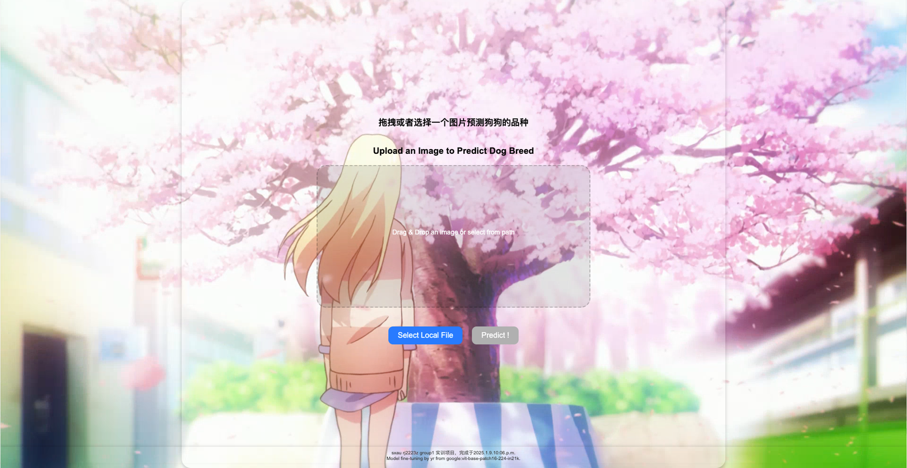

[中文](README_zh.md)|[English](README.md)

# Dog Breed Classification - Based on ViT

## Note

This project is a group project for the 2022 training program at Shanxi Agricultural University. The code was completed by the group leader within two days, implementing only basic logic. Due to limited computational resources and time, the model is not optimized. Increasing the number of `epochs` during training is recommended to improve performance.

## Project Overview

This project fine-tunes the `vit-base-patch16-224-in21k` model provided by Google to classify dog breeds.
- **Training Duration**: 5 epochs.
- **Deep Learning Framework**: PyTorch.
- **Frontend and Backend**: Flask and HTML.

With simple steps, you can access the WebUI on local port `5050` and drag and drop images for dog breed classification.

## Project Structure

```
.
├── app/                # Frontend and backend code
│   ├── app.py          # Flask backend main program
│   ├── index.html      # Frontend HTML file
│   ├── static/         # Static resources
│   └── uploads/        # Directory for uploaded images
├── models/             # Directory for fine-tuned models
│   └── vit_finetuned_StanfordDogs_ep5
├── training/           # Training-related code
│   ├── eva.ipynb
│   ├── training_vit_dogs.ipynb
│   ├── vit_on_cifar10.ipynb
│   └── vit_on_stanford_dogs-Copy1.ipynb
├── uploads/            # Upload directory
└── README.md           # Project description file
```

## Quick Start

### Environment Requirements
- **Operating System**: Linux Ubuntu 24.04
- **CUDA**: 12.1
- **Python**: 3.11
- **Torch**: 2.5.0
- **Torchvision**: 0.20.0
- **Transformers**: 4.47.1

### Install Dependencies
Ensure your Python environment meets the requirements and install the necessary dependencies:

```bash
pip install torch torchvision transformers flask
```

Additionally, install and initialize Git LFS:

```bash
git lfs install
```

In the project directory, use Git LFS to download the large files:

```bash
git lfs pull
```

### Start the Project

1. Navigate to the project directory:
   ```bash
   cd vit_dogs_classifier
   ```

2. Navigate to the `app/` directory:
   ```bash
   cd app/
   ```

3. Start the service:
   ```bash
   python app.py
   ```

4. Open your browser and visit [http://localhost:5050](http://localhost:5050).

5. Drag and drop an image to the interface for classification.



## Training Parameters

- **Data Path**: `data_dir = "./data/Images"`
- **Hyperparameters**:
  ```python
  learning_rate = 5e-5
  batch_size = 128
  training_steps = 1000
  num_classes = 120
  num_epochs = 5
  ```
- **Adam Optimizer Parameters**:
  ```python
  betas = (0.9, 0.999)
  eps = 1e-8
  ```

## Training Details

The training code is located in the `./training/` directory and can be executed directly.

Dataset download link: [Stanford Dogs Dataset](http://vision.stanford.edu/aditya86/ImageNetDogs/).

Model source: [Hugging Face ViT Base](https://huggingface.co/google/vit-base-patch16-224-in21k).

Parameter reference: [Training Parameters](https://huggingface.co/amaye15/google-vit-base-patch16-224-batch64-lr0.005-standford-dogs).

## Frontend Design

The frontend mouse trail effect design is inspired by: [Chokcoco CodePen](https://codepen.io/Chokcoco/pen/XgvjQM).


---

## License

This project is licensed under the MIT License - see the [LICENSE](LICENSE) file for details.

---

Thank you for using this project! Please provide feedback if you encounter any issues.

